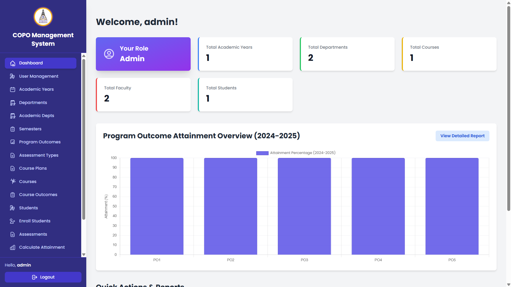
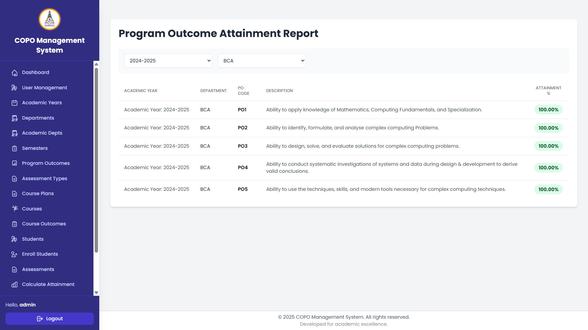
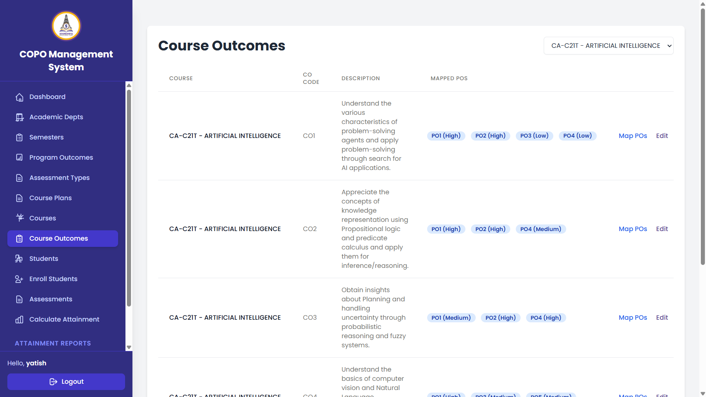
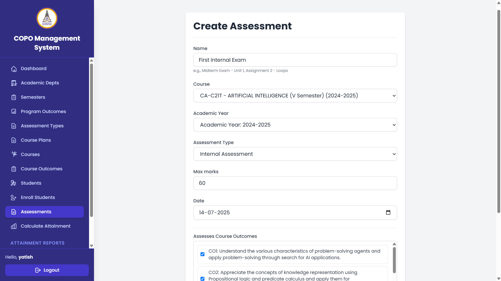
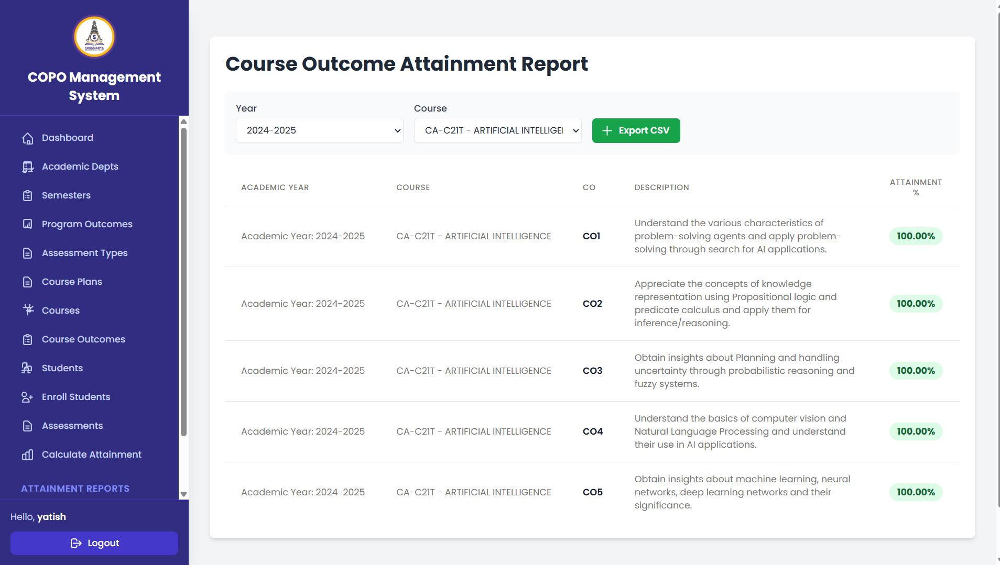
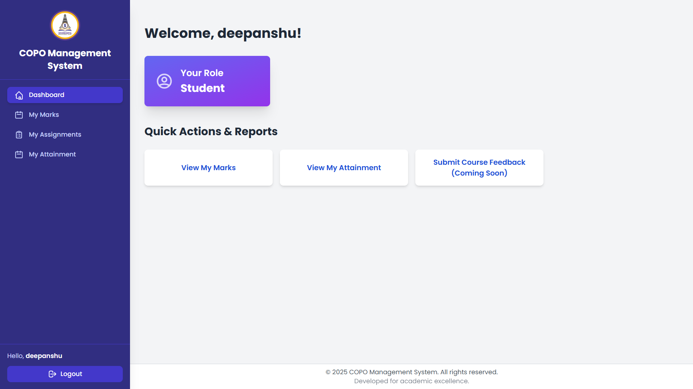

# COPO Management System

A comprehensive web-based system for managing Course Outcomes (CO) and Program Outcomes (PO) assessment and attainment in educational institutions.



## Table of Contents

- [Overview](#overview)
- [Features](#features)
- [Technology Stack](#technology-stack)
- [Installation](#installation)
- [Usage](#usage)
- [User Roles](#user-roles)
- [Project Structure](#project-structure)
- [Screenshots](#screenshots)
- [Contributing](#contributing)
- [License](#license)

## Overview

The COPO Management System helps educational institutions track, measure, and assess student learning outcomes effectively. It provides a complete solution for defining program outcomes, mapping course outcomes, creating assessments, recording student performance, and calculating attainment levels.

This system enables institutions to implement outcome-based education frameworks effectively while providing data-driven insights into student learning and program effectiveness.

## Features

### User Management
- Role-based access control (Admin, HOD, Faculty, Student)
- Secure authentication and authorization

### Departments and Programs
- Manage multiple departments
- Define program-specific outcomes

### Course Management
- Create and manage courses
- Develop course plans
- Manage semesters

### Outcome Definition and Mapping
- Define Program Outcomes (POs)
- Create Course Outcomes (COs)
- Map COs to POs with correlation levels

### Assessment Management
- Define assessment types
- Create various assessment components
- Support for rubric-based evaluation
- Assignment creation and submission

### Attainment Calculation
- Calculate CO attainment through direct and indirect methods
- Calculate PO attainment based on CO-PO mapping
- Generate detailed attainment reports

### Reporting and Analytics
- Visual dashboards with attainment charts
- Detailed attainment reports for courses and programs
- Export functionality for reports

### Student Portal
- View personal marks and assignments
- Track personal attainment levels
- Submit assignments

## Technology Stack

- **Backend**: Django 5.2.3
- **Frontend**: HTML, CSS, JavaScript, Tailwind CSS
- **Database**: PostgreSQL
- **Visualization**: Chart.js
- **Authentication**: Django's built-in authentication system

## Installation

```bash
# Clone the repository
git clone https://github.com/yourusername/copo_management_system.git
cd copo_management_system

# Create a virtual environment
python -m venv venv
source venv/bin/activate  # On Windows, use: venv\Scripts\activate

# Install dependencies
pip install -r requirements.txt

# Apply migrations
python manage.py migrate

# Create a superuser
python manage.py createsuperuser

# Run the development server
python manage.py runserver
```

## Usage

1. **Initial Setup**:
   - Log in as admin and create departments
   - Add program outcomes for each department
   - Create courses and map them to departments
   - Define course outcomes and map them to program outcomes

2. **Faculty Workflow**:
   - Create assessments and assignments
   - Record student marks
   - Calculate attainment

3. **Student Workflow**:
   - View assignments and submit work
   - Check marks and attainment levels

## User Roles

### Administrator
- Manage all system aspects
- Create departments and users
- Access all reports and data

### Head of Department (HOD)
- Manage department-specific data
- Define program outcomes
- View department-wide reports

### Faculty
- Manage assigned courses
- Create assessments and assignments
- Record student marks
- Calculate and view attainment

### Student
- View personal course information
- Submit assignments
- View personal marks and attainment

## Project Structure

```
copo_management_system/
├── academics/                 # Main application for academic features
│   ├── templates/             # HTML templates for academic views
│   ├── models.py              # Database models
│   ├── views.py               # View functions and logic
│   └── ...
├── copo_management_system/    # Project settings and configuration
│   ├── templates/             # Base templates
│   ├── settings.py            # Django settings
│   └── ...
├── staticfiles/               # Compiled static files
├── static/                    # Source static files
│   ├── dist/                  # Processed CSS/JS files
│   └── images/                # Image assets
└── requirements.txt           # Project dependencies
```

## Screenshots

### Dashboard


### Program Outcomes Management


### Course Outcomes Mapping


### Assessment Creation


### Attainment Reports


### Student View


## Contributing

1. Fork the repository
2. Create your feature branch (`git checkout -b feature/amazing-feature`)
3. Commit your changes (`git commit -m 'Add some amazing feature'`)
4. Push to the branch (`git push origin feature/amazing-feature`)
5. Open a Pull Request

## License

This project is licensed under the MIT License - see the LICENSE file for details.

---

**Note:** This README provides an overview of the COPO Management System. For detailed documentation, please refer to the project wiki or contact the development team.